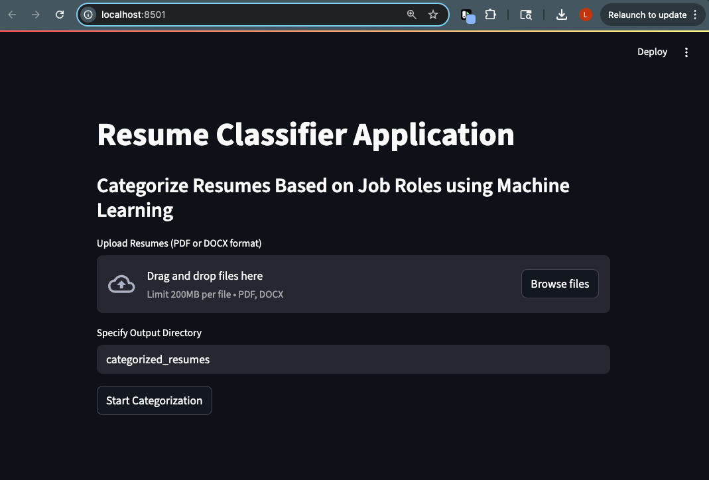
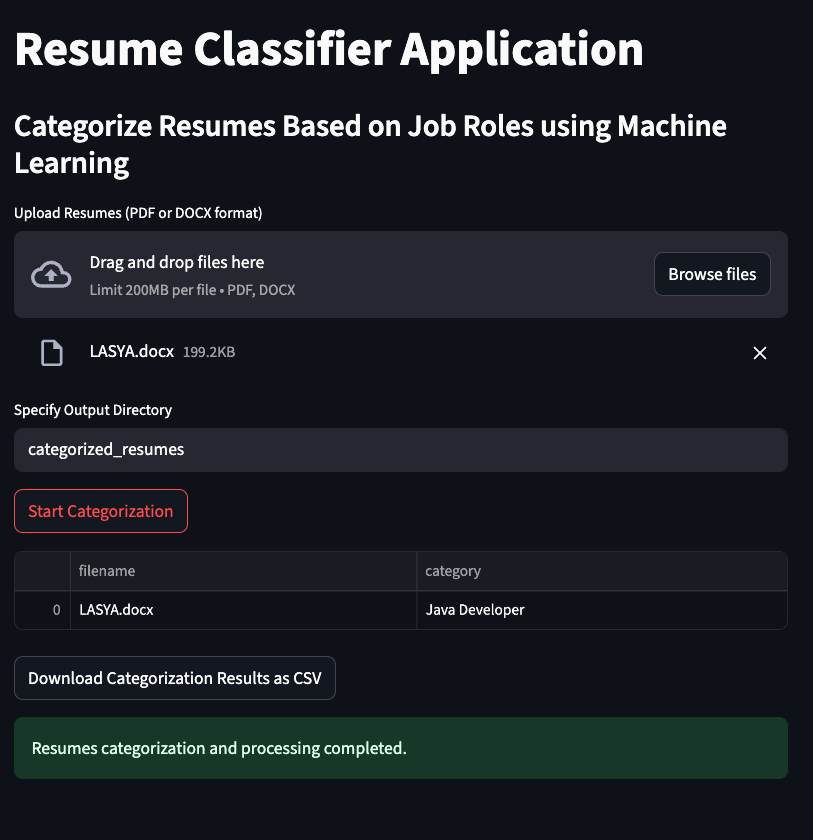

# 📄 Resume Classifier Application

Categorize resumes into job roles using Machine Learning and NLP.

This project is a **Streamlit-based application** that allows users to upload PDF/DOCX resumes and automatically classifies them into job categories using a trained Logistic Regression model and TF-IDF vectorizer.

---

## 🧠 Model Overview

The model was trained on labeled resume data with the following steps:

- **Preprocessing**: Cleaned and normalized text
- **Vectorization**: TF-IDF with `TfidfVectorizer`
- **Classifier**: Logistic Regression
- **Performance**: ~85% accuracy on validation set

> 📊 Detailed metrics including classification report and confusion matrix are available in `Application/model_training.ipynb`.

---

## 🚀 Features

- ✅ **Upload Resumes** in `.pdf` or `.docx` format
- ✅ **Categorize** resumes into 25+ job roles (e.g., Java Developer, Data Scientist, HR, etc.)
- ✅ **View and download results** as a CSV
- ✅ **Automatic folder sorting** by predicted category
- ✅ **Real-time interface** with Streamlit

---

## 🖼️ Screenshots

### 🔹 App Homepage


### 🔹 After Resume Upload and Categorization


---

## 📁 Project Structure
Resume-Categorization/
│
├── Application/
│ ├── application.py # Streamlit interface
│ ├── model_training.ipynb # Notebook for model training and evaluation
│ ├── categorized_resumes/ # Output folder after classification
│ ├── Resumes/ # Sample input resumes
│
├── Weights/
│ ├── model.pkl # Trained logistic regression model
│ ├── tfidf.pkl # TF-IDF vectorizer
│
├── screenshots/
│ ├── app_home.png
│ ├── app_result.png
│
├── requirements.txt # Python dependencies
└── README.md # Project documentation

## ⚙️ Installation & Usage

### 🔸 1. Install Requirements

```bash
pip install -r requirements.txt

manual installation:
pip install streamlit scikit-learn pandas python-docx pypdf
```
### 2. Run the Application
```bash
streamlit run Application/application.py
```

### 3. Upload Resumes
- Upload one or more resumes (PDF/DOCX)
- View predicted category
- Download results as CSV
- Categorized files will be saved to: categorized_resumes/<Job_Category>/
